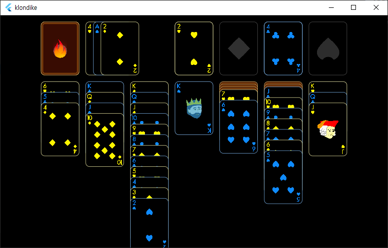

# Klondike

simple game from [flame engine](https://github.com/flame-engine/flame) tutorials.

## KlondikeGame(extends FlameGame) class
* World 객체(world)를 생성해서 child로 추가한다.
  * StockPile 객체(stock)를 생성해서 world에 추가 한다. 
  * WastePile 객체(stock)를 생성해서 world에 추가 한다.
  * FoundationPile 객체(foundations)를 생성해서 world에 추가 한다.
  * TableauPile 객체(piles)를 생성해서 world에 추가 한다.
* Camera 객체를 생성해서 child로 추가한다.
* Card 객체(cards)를 모두 생성해서 child로 추가한다.
  * Card 객체를 piles와 stock에 쌓는다.

## World & CameraComponent
* The primary feature of World component is that it disables regular rendering, and allows itself to be rendered through a CameraComponent only.
* The updates proceed through the world tree normally.
* CameraComponent is a component through which a World is observed.
  * world를 파라미터로 받는다.
  * viewfinder로 어떤 부분이 보이는 지를 결정한다.
  * viewport로 window를 설정한다.

## Card(extends PositionComponent with DragCallbacks) class
* @override Component.render(Canvas)에서 카드 모양을 그린다.
  * [Canvas](https://api.flutter.dev/flutter/dart-ui/Canvas-class.html)의 draw 함수를 사용한다.
  * [Sprite](https://pub.dev/documentation/flame/latest/sprite/Sprite-class.html)는 Sprite.render(Canvas) 함수로 그린다.
* DragCallbacks mixin으로 카드 이동시킨다.
  * @override onDragStart, onDragEnd, onDragUpdate 함수
  * Component.priority로 컴포넌트의 렌더링 순서를 결정한다.
    * 이동시킬 카드의 priority를 크게 설정한다(+100).
  * Position.Component의 position property를 바꿔서 이동시킨다.
    * camera zoom을 적용한다.
  * parent!.componentsAtPoint() 함수로 drop되는 pile 컴포넌트를 찾는다.
    * pile!.removeCard()로 이전 pile에서 제거하고
    * dropPiles.first.acquireCard()로 새로운 pile에 추가한다.

## Suit & Rank class
* Suit: 카드의 종류, Rank: 카드의 번호(1~10, J, Q, K)
* singleton pattern 과 factory constructor를 정의한다.

## StockPile(extends PositionComponent with TapCallbacks implements Pile) class
* @override Component.render(Canvas)에서 모양을 그린다.
* TapCallbacks mixin으로 카드를 펼친다.
  * @override onTapUp 함수
    * card를 wastePile로 옮긴다.
* @override Pile.acquireCard로 pile에 카드를 추가한다.
  * _card 리스트에 추가한다. 
  * Component.priority로 컴포넌트의 렌더링 순서를 결정한다.
    * pile에 쌓일 때, 쌓이는 순서로 priority를 설정한다.

## WastePile(extends PositionComponent implements Pile) class
## FoundationPile(extends PositionComponent implements Pile) class
## TableauPile(extends PositionComponent implements Pile) class
